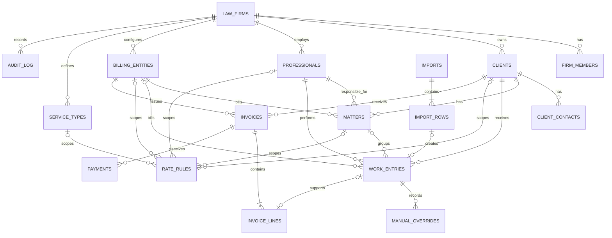

# Modelo de dados PostgreSQL

## Objetivo

O modelo normaliza clientes, assuntos, trabalho, preços, faturação interna, pagamentos, importações e auditoria. O Excel não é copiado para uma tabela única. Todos os dados de negócio são isolados por `firm_id`.

O modelo não implementa faturação fiscal certificada e não cria processos durante a primeira importação. `work_entries.matter_id` permanece opcional.

## Diagrama ER

## Decisões estruturais

- UUID em entidades principais; `timestamptz` para auditoria temporal.
- Dinheiro em `numeric`, nunca `float`; moeda ISO de três letras, inicialmente `EUR`.
- `duration_minutes` é inteiro. Frações de dia são convertidas antes da persistência.
- Chaves estrangeiras compostas `(firm_id, id)` impedem relações entre escritórios, mesmo perante erro de aplicação.
- Estados são `text` com `check`, facilitando evolução controlada sem alterações destrutivas de enums.
- `service_types` foi acrescentada porque é referenciada por regras de preço.
- Nenhum nome histórico é inserido automaticamente. Sociedades e profissionais serão importados após confirmação.

## Integridade e auditoria

- `effective_hourly_rate` e `effective_amount` só mudam quando existe `manual_overrides` correspondente na mesma transação.
- Apenas owner/admin/billing pode mudar campos financeiros, faturação ou pagamento.
- Trabalho faturado não pode ser eliminado, mesmo por acesso administrativo direto.
- Alterações em trabalho, overrides, faturas, linhas, pagamentos e importações alimentam `audit_log`.
- `private.revert_import(uuid)` reverte lotes apenas para papéis autorizados e quando não existem linhas faturadas.
- Não existem políticas `DELETE` para clientes da aplicação.

## Impacto da migration

Cria os schemas/tabelas/índices/funções/triggers/políticas descritos, mas não move dados nem cria utilizadores, sociedades, clientes ou profissionais. O schema `public` é explicitamente concedido a `authenticated` apenas nas operações previstas; `anon` não recebe acesso.

A versão local está configurada com PostgreSQL 17. Antes do deploy deve confirmar-se `show server_version` no projeto remoto e ajustar `supabase/config.toml` se necessário.

## Estratégia de reversão

Antes do primeiro deploy:

1. Confirmar backup/PITR do projeto e executar a migration numa branch/staging.
2. Executar pgTAP e advisors.
3. Só promover após revisão do diagrama e políticas.

Como a migration ainda não foi aplicada, a reversão atual é simplesmente não a promover. Depois de aplicada, preferir uma migration corretiva. Uma remoção integral só é segura antes de existirem dados e deve eliminar, por ordem, políticas/triggers, tabelas dependentes, funções `private` e finalmente o schema privado. Nunca executar `drop ... cascade` em produção sem inventário e backup verificado.
